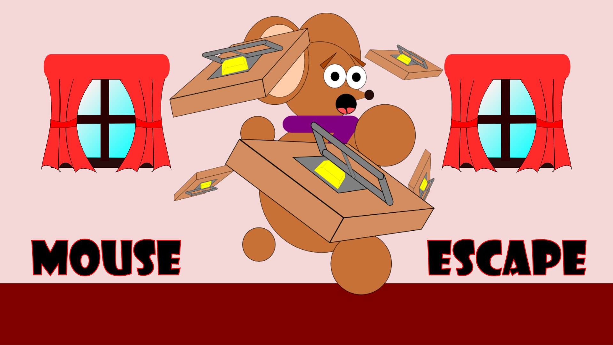

# Mouse Escape

Juego creado con Unity que consite en activar las trampas que van apareciendo para que el ratón no caiga en ellas.

## Run

La última versión de Unity que se utilizó en el proyecto fue: 2020.3.27f1 Personal.
Lo único que se tendría que hacer es clonar el proyecto y Unity tendría que hacer el resto.

## Consideraciones 

La carpeta docs es una versión de producción para que se ejecute en GitHub Pages. Puedes verlo [aquí](https://jbs-code.github.io/mouse-scape/).
  
  
